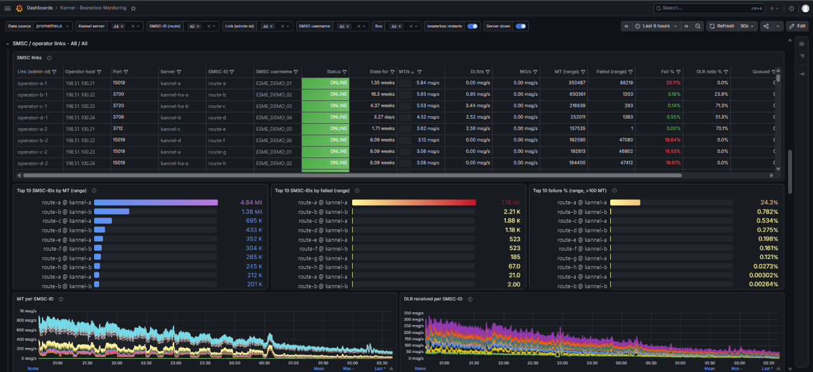
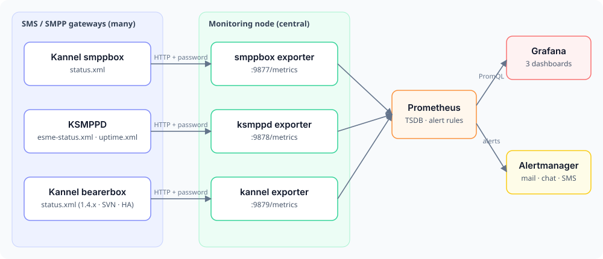
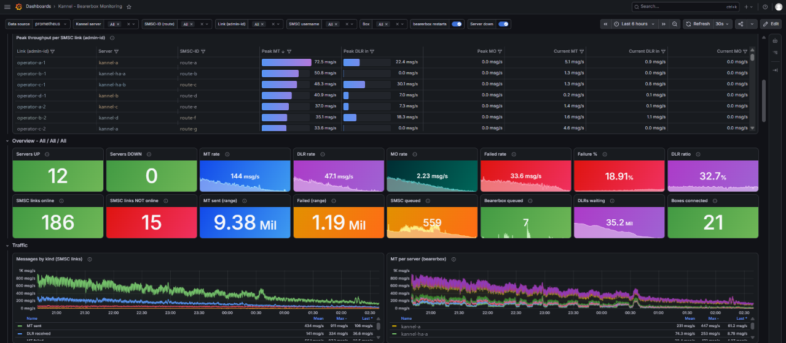
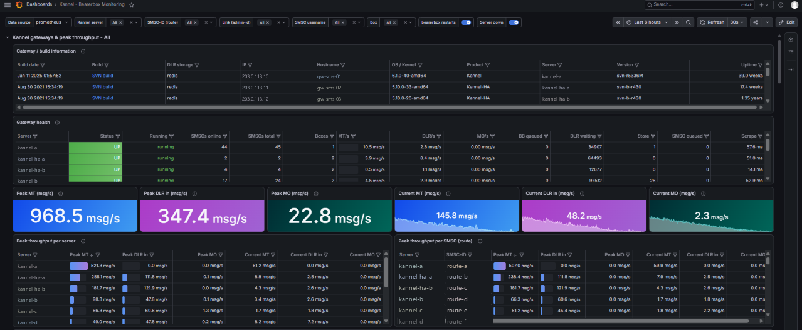
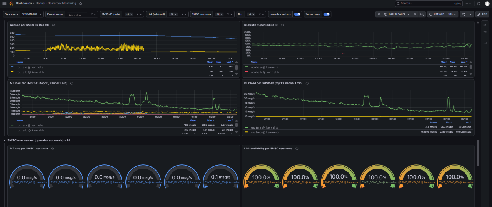
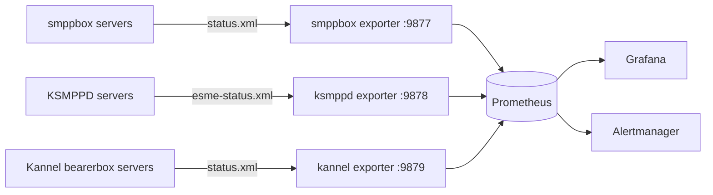

# SMPP Prometheus Exporter – Kannel, smppbox & KSMPPD monitoring with Grafana

[](https://github.com/AISH-HAMZA/smpp-prometheus-exporter/actions/workflows/ci.yml)
[](LICENSE)


**Production-tested Prometheus exporters, Grafana dashboards and alert rules for SMS / SMPP gateways:
Kannel bearerbox, Kannel smppbox and KSMPPD.** One small Python process watches all your gateway servers, so you can
see every customer (ESME), SMSC link, TPS limit and delivery report on one Grafana screen, and get alerts before
your customers notice.






## Screenshots

<sub>Real production dashboards; server, customer, operator and IP names replaced with dummy values.</sub>

| Kannel bearerbox | KSMPPD | Kannel smppbox |
|---|---|---|
| [](docs/images/kannel-overview.png) | [](docs/images/ksmppd-overview-tps-limits.png) | [](docs/images/smppbox-overview.png) |
| [](docs/images/kannel-gateways-peak-throughput.png) | [](docs/images/ksmppd-servers-peak-throughput.png) | [](docs/images/smppbox-gateways-peak-throughput.png) |
| [](docs/images/kannel-smsc-usernames.png) | [](docs/images/ksmppd-customer-traffic-errors.png) | [](docs/images/smppbox-traffic.png) |

## Why?

SMS gateways only have a status page. You can't see traffic history or per-customer throughput on it, and nothing
pages you when an operator link goes down at 3 a.m. These exporters turn those status pages into Prometheus
metrics:

* **Central by design** – one exporter scrapes *many* gateway servers. Nothing is installed on the gateways.
* **Three gateway types** – Kannel bearerbox (1.4.x, SVN, Kannel-HA), Kannel smppbox and KSMPPD.
* **Correct counters** – smppbox session counters reset on every reconnect; the exporter keeps them monotonic,
  without the "billions of messages" spikes ([how](docs/design-notes.md)).
* **Ready-made dashboards** – 70+ panels per gateway with hover help, from overview down to single customer or link.
* **Alert rules included** – gateway down, SMSC link down/flapping, queues growing, customer disconnected, TPS limit.
* **Tiny** – single-file Python, two dependencies (`prometheus_client`, `PyYAML`), Docker image and systemd units.

## 60-second quick start (Docker demo)

No gateway needed. A mock gateway generates realistic, fictional traffic.

```bash
git clone https://github.com/AISH-HAMZA/smpp-prometheus-exporter.git
cd smpp-prometheus-exporter/deploy/docker
docker compose up -d --build
```

Open **http://localhost:3000** (admin / admin) → folder *SMS Gateways*. Prometheus: http://localhost:9090.

## Production install (central mode)

```bash
sudo pip3 install -r requirements.txt
sudo mkdir -p /opt/smpp-exporter/kannel
sudo cp exporters/kannel/kannel_exporter.py /opt/smpp-exporter/kannel/
sudo cp exporters/kannel/config.example.yml /opt/smpp-exporter/kannel/config.yml   # add gateways + status passwords
python3 /opt/smpp-exporter/kannel/kannel_exporter.py -c /opt/smpp-exporter/kannel/config.yml --once | grep _up
sudo cp deploy/systemd/kannel_exporter.service /etc/systemd/system/ && sudo systemctl enable --now kannel_exporter
```

Do the same for `smppbox` / `ksmppd`, add the [scrape jobs](deploy/prometheus/prometheus-scrape.example.yml), import
`dashboards/*.json` into Grafana and copy `alerts/*.yml` to Prometheus.
**Full guide (central, per-node, single-node, Docker):** [docs/installation.md](docs/installation.md).

## The three exporters

| | Kannel bearerbox | Kannel smppbox | KSMPPD |
|---|---|---|---|
| Directory | [`exporters/kannel`](exporters/kannel) | [`exporters/smppbox`](exporters/smppbox) | [`exporters/ksmppd`](exporters/ksmppd) |
| Status page | `/status.xml` | `/status.xml` | `/esme-status.xml` or `/esme-status` + `/uptime.xml` |
| Port | **9879** | **9877** | **9878** |
| Role | core router to operators (SMSC links) | SMPP server for customers | SMPP server for customers |
| Key metrics | SMSC link state & flaps, MT/MO/DLR per link, queues, DLR ratio, SMSC username/host/port, boxes, Kannel-HA extras | per-customer & per-bind-type traffic, connected state, sessions, source IPs, plugins/DB pools, peak throughput | TPS limit vs achieved TPS, utilisation & headroom, MT/MO/DLR/errors, per-bind loads & queues |
| Alert rules | 11 | 9 | 9 |

All metrics: [docs/metrics.md](docs/metrics.md).

## Dashboards

Each dashboard goes from **all gateways → one server → one customer / link**, using variables for server,
customer (ESME), SMSC-ID and bind type:

* **Kannel bearerbox:** overview, SMSC links & routes (availability timeline, links with problems), SMSC usernames,
  queues & loads, boxes, DLR ratio.
* **smppbox:** gateways & peak throughput, traffic, servers, customers (top-10, failure %, connection history),
  connections by bind type, source IPs, plugins & DB.
* **KSMPPD:** overview, customers, TPS limit / utilisation / headroom, binds, errors.

Dashboards are generated by `tools/gen_*_dashboard.py` – see [CONTRIBUTING.md](CONTRIBUTING.md).

## How it works



More: [architecture](docs/architecture.md) · [design notes](docs/design-notes.md) · [configuration](docs/configuration.md).

## New to SMPP?

| Term | In one line |
|---|---|
| **SMPP** | The protocol SMS companies and mobile operators use to exchange messages. |
| **SMSC** | The operator's SMS centre; in Kannel, a link to one. |
| **ESME** | A client of an SMPP server – usually your customer (identified by *system-id*). |
| **MT / MO** | Message *to* a phone / message *from* a phone. |
| **DLR** | Delivery report – did the message arrive? |
| **TPS** | Messages per second – the agreed throughput limit. |
| **Bind** | An SMPP session: transmitter (send), receiver (receive) or transceiver (both). |

More in the [FAQ](docs/faq.md).

## Documentation

[Installation](docs/installation.md) · [Configuration](docs/configuration.md) · [Metrics](docs/metrics.md) ·
[Architecture](docs/architecture.md) · [Troubleshooting](docs/troubleshooting.md) · [FAQ](docs/faq.md) ·
[Design notes](docs/design-notes.md) · [Changelog](CHANGELOG.md)

## Roadmap

- [ ] Grafana.com dashboard listings
- [ ] Prebuilt image on GitHub Container Registry
- [ ] Jasmin SMS gateway and OpenSMPPBox support
- [ ] Optional per-target labels (site, environment)

Ideas welcome in [Discussions](https://github.com/AISH-HAMZA/smpp-prometheus-exporter/discussions).

## Contributing

Bug reports with a sanitised status page are gold. See [CONTRIBUTING.md](CONTRIBUTING.md) and the
[Code of Conduct](CODE_OF_CONDUCT.md). Security issues: [SECURITY.md](SECURITY.md).

## License

[Apache License 2.0](LICENSE).

---

⭐ **If this saves you a night of debugging an SMS gateway, please star the repo** – it helps other telecom
engineers find it.
