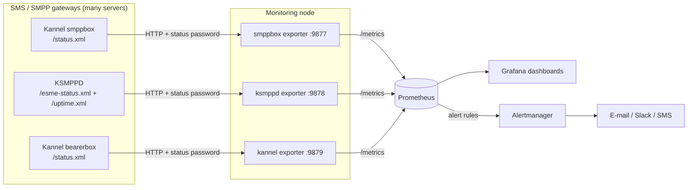
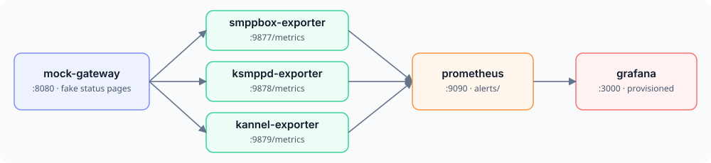
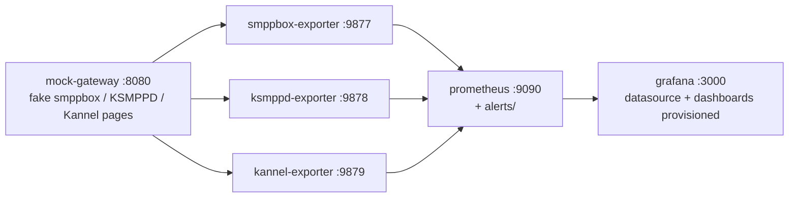

# Architecture




## Data flow

1. **Gateways** expose an admin/status HTTP page protected by a status password. Nothing is installed on them.
2. **Exporters** (one per gateway type) poll every configured gateway in parallel every `scrape_interval` seconds,
   parse the XML/text, keep state (counters that survive reconnects, connection state, link flaps) and serve the latest
   result on `/metrics`. Every series gets a `server` label.
3. **Prometheus** scrapes the three `/metrics` endpoints and evaluates the alert rules from `alerts/`.
4. **Grafana** shows the generated dashboards: overall → per server → per customer (ESME) / per SMSC link drill-down.
5. **Alertmanager** routes the alerts (gateway down, link down, queue growing, customer disconnected, TPS limit, …).

## Docker demo stack





## Repository layout

```
exporters/<gw>/        exporter (single Python file), config.example.yml, README with metric table
dashboards/            generated Grafana dashboards + provisioning examples
alerts/                Prometheus alert rules
deploy/systemd/        systemd units
deploy/docker/         Dockerfile, docker-compose demo, Prometheus + Grafana provisioning
deploy/prometheus/     scrape config example
tools/                 dashboard generators (python3 tools/gen_<gw>_dashboard.py)
examples/              mock gateway + fictional sample status pages
tests/                 pytest: parsers, counter logic, end-to-end, dashboards
docs/                  installation, configuration, metrics, troubleshooting, FAQ, design notes
```

Why the exporters are built this way: [design-notes.md](design-notes.md).
