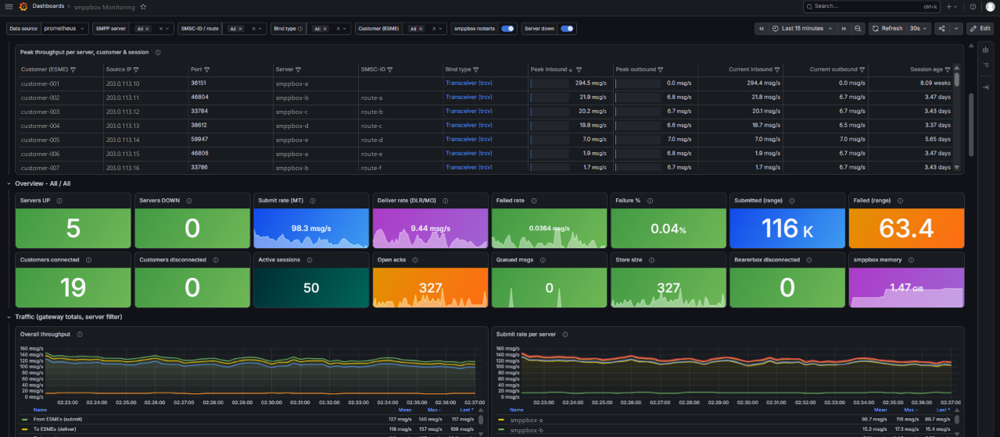
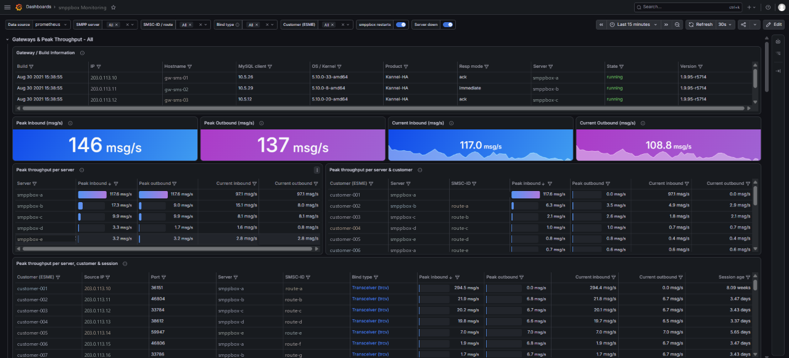
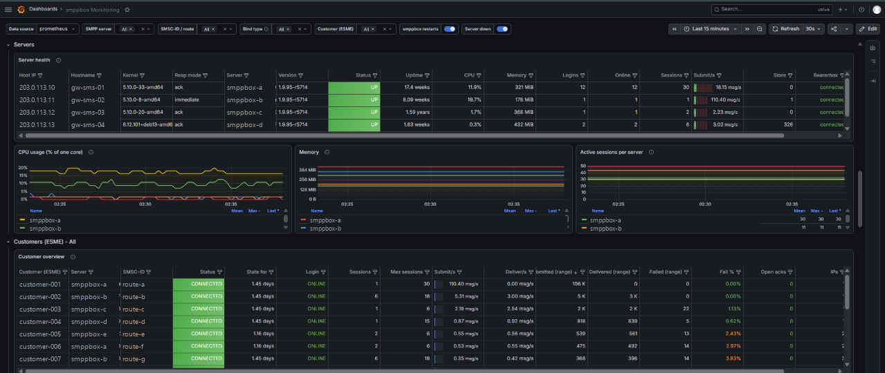
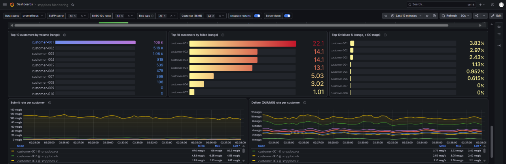
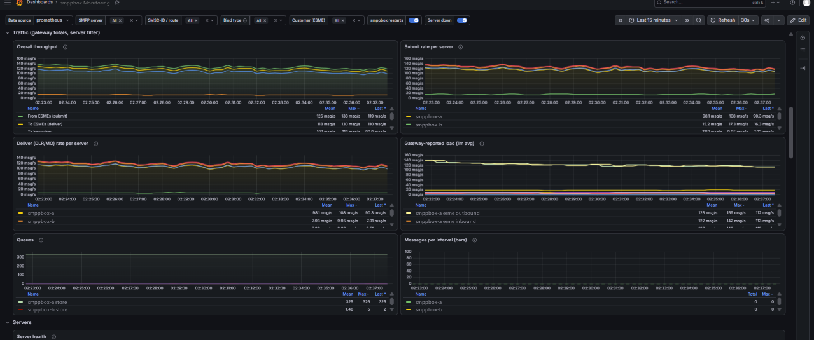

# Deploy the Kannel smppbox exporter

Monitor Kannel smppbox and Kannel-HA smppbox with Prometheus and Grafana. Pick **one** of the two ways below – both take about 5 minutes.

| | Same node | Central |
|---|---|---|
| Where the exporter runs | on **each** Kannel smppbox server | on **one** monitoring server |
| It reads | `127.0.0.1:14000/status.xml` | every server's `/status.xml` over the network |
| Use it when | one server, or the admin port must stay closed | several servers – one place to manage ⭐ |
| Prometheus scrapes | every gateway server `:9877` | only the monitoring server `:9877` |

## Before you start (both ways)

1. Find the admin port and status password: your smppbox config (`group = smppbox`): the admin port and the status/admin password.
2. Check the status page answers (on the gateway server):

   ```bash
   curl -s "http://127.0.0.1:14000/status.xml?password=STATUS_PASSWORD" | head -5
   ```

   You should see XML. `Denied` = wrong password. No answer = wrong port.
3. Get the code on the server that will run the exporter:

   ```bash
   git clone https://github.com/AISH-HAMZA/smpp-prometheus-exporter.git
   cd smpp-prometheus-exporter
   ```

## Way 1 – same node (exporter on the Kannel smppbox server)

```bash
sudo ./deploy/install.sh smppbox --local --password 'STATUS_PASSWORD'
```

Different port or HTTPS? Give the full URL instead: `--url "https://127.0.0.1:14000/status.xml?password=..."`.
Repeat on every Kannel smppbox server, then list them all in Prometheus:

```yaml
  - job_name: smppbox_exporter
    static_configs:
      - targets: ['192.0.2.10:9877', '192.0.2.11:9877']
```

## Way 2 – central (one monitoring server for all Kannel smppbox servers) ⭐

On the monitoring server:

```bash
sudo ./deploy/install.sh smppbox   --target smppbox-a=http://192.0.2.10:14000/status.xml?password=STATUS_PASSWORD   --target smppbox-b=http://192.0.2.11:14000/status.xml?password=STATUS_PASSWORD
```

`smppbox-a` is the name you will see in Grafana – keep it short and stable. Allow the monitoring server to reach
port 14000 on every gateway. Prometheus only needs one target:

```yaml
  - job_name: smppbox_exporter
    static_configs:
      - targets: ['MONITORING_SERVER_IP:9877']
```

Add or remove gateways later: edit `/opt/smpp-exporter/smppbox/config.yml`, then `sudo systemctl reload smppbox_exporter`.

## Docker instead of systemd (either way)

```bash
cp exporters/smppbox/config.example.yml /etc/smppbox-exporter.yml        # edit targets + passwords
docker build -f deploy/docker/Dockerfile -t smpp-prometheus-exporter .
docker run -d --name smppbox-exporter --restart unless-stopped --network host   -e EXPORTER=smppbox -v /etc/smppbox-exporter.yml:/etc/smpp-exporter/config.yml:ro smpp-prometheus-exporter
```

(`--network host` lets the container reach `127.0.0.1` in same-node mode.)

## Finish: Prometheus, Grafana, alerts

1. Add the `job_name` block above to `prometheus.yml` under `scrape_configs:` and reload Prometheus.
   *Status → Targets* must show `smppbox_exporter` as **UP**.
2. Grafana → *Dashboards → New → Import* → upload [`dashboards/smppbox_dashboard.json`](../dashboards/smppbox_dashboard.json) → pick
   your Prometheus data source.
3. Optional alerts: copy [`alerts/smppbox_alerts.yml`](../alerts/smppbox_alerts.yml) next to `prometheus.yml` and add it under `rule_files:`.

## Check it works

```bash
systemctl status smppbox_exporter
curl -s localhost:9877/metrics | grep smppbox_up        # 1 = gateway OK, 0 = see the log
journalctl -u smppbox_exporter -n 30
```

## Update or remove

```bash
cd smpp-prometheus-exporter && git pull && sudo ./deploy/install.sh smppbox        # updates the code, keeps your config
sudo ./deploy/install.sh smppbox --uninstall            # add --purge to also delete the config
```

All settings: [configuration.md](configuration.md) · Problems: [troubleshooting.md](troubleshooting.md) ·
Metrics: [metrics.md](metrics.md) · Exporter details: [exporters/smppbox](../exporters/smppbox/README.md)

## What you get






