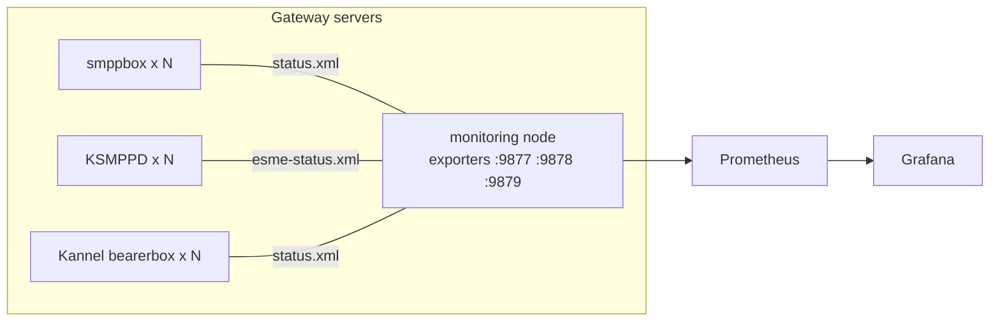

# Installation guide

This guide installs the SMPP Prometheus exporters for **Kannel bearerbox**, **Kannel smppbox** and **KSMPPD**, plus
Prometheus alert rules and Grafana dashboards. Pick the deployment style that fits you:

| Style | Where the exporters run | Best for |
|---|---|---|
| [Docker demo](#1-docker-demo-60-seconds) | containers on your laptop | trying it out, zero gateways needed |
| [Central](#2-central-deployment-recommended) ⭐ | **one** monitoring node scrapes all gateways over the network | most production setups |
| [Per node](#3-per-node-deployment) | on every gateway server, scraping `localhost` | strict firewalls, no network access to admin ports |
| [Single node](#4-single-node-all-in-one) | gateway + exporter + Prometheus + Grafana on one box | labs, small installs |
| [Docker in production](#5-docker-in-production) | containers next to your Prometheus | container-based monitoring stacks |

Ports used by the exporters: **smppbox 9877**, **KSMPPD 9878**, **Kannel 9879** (`/metrics`).

---

## Prerequisites

* Linux with **Python 3.8+** (`python3 --version`) – or Docker.
* Network access from the exporter host to the gateway **admin / status port**:
  * Kannel bearerbox: `admin-port` from `group = core` (often 13000) → `/status.xml`
  * Kannel smppbox: smppbox admin port (often 14000) → `/status.xml`
  * KSMPPD: HTTP admin port (often 14000) → `/esme-status.xml` (or `/esme-status`) and `/uptime.xml`
* The **status password** (`status-password`, or the admin password) of each gateway.
* Prometheus 2.x/3.x and Grafana 10+ (any recent version works).

### How to find and test the status URL

```bash
# Kannel bearerbox (kannel.conf, group = core: admin-port, status-password)
curl -s "http://192.0.2.30:13000/status.xml?password=YOUR_STATUS_PASSWORD" | head
# Kannel smppbox
curl -s "http://192.0.2.10:14000/status.xml?password=YOUR_STATUS_PASSWORD" | head
# KSMPPD
curl -s "http://192.0.2.20:14000/esme-status.xml?password=YOUR_STATUS_PASSWORD" | head
```

You should see XML starting with `<gateway>` (Kannel/smppbox) or `<esmes>` (KSMPPD).
`Denied` means the password is wrong. A timeout means a firewall is in the way.

---

## 1. Docker demo (60 seconds)

Needs Docker with the compose plugin. No real gateway is needed – a mock gateway serves fictional
status pages with live, moving counters.

```bash
git clone https://github.com/AISH-HAMZA/smpp-prometheus-exporter.git
cd smpp-prometheus-exporter/deploy/docker
docker compose up -d --build
```

| URL | What |
|---|---|
| http://localhost:3000 | Grafana (admin / admin) – folder **SMS Gateways** has all three dashboards |
| http://localhost:9090 | Prometheus (alerts are loaded from `alerts/`) |
| http://localhost:9877/metrics · :9878 · :9879 | the three exporters |
| http://localhost:8080 | mock gateway (`/smppbox-a/status.xml?password=demo` …) |

Give it 2–3 minutes for rates to appear. Stop with `docker compose down` (add `-v` to delete the data).

---

## 2. Central deployment (recommended)

One monitoring node runs all three exporters and scrapes every gateway's status page. Prometheus and Grafana run on
the same node or elsewhere. Nothing is installed on the gateways.



### 2.1 Install the files

```bash
sudo apt install -y python3 python3-pip          # RHEL/Rocky: sudo dnf install -y python3 python3-pip
git clone https://github.com/AISH-HAMZA/smpp-prometheus-exporter.git
cd smpp-prometheus-exporter
sudo pip3 install -r requirements.txt            # prometheus_client, PyYAML
# Debian 12+/Ubuntu 23.04+ block system-wide pip: use  sudo apt install -y python3-prometheus-client python3-yaml

sudo mkdir -p /opt/smpp-exporter/{smppbox,ksmppd,kannel}
sudo cp exporters/smppbox/smpp_exporter.py  /opt/smpp-exporter/smppbox/
sudo cp exporters/ksmppd/ksmppd_exporter.py /opt/smpp-exporter/ksmppd/
sudo cp exporters/kannel/kannel_exporter.py /opt/smpp-exporter/kannel/
for g in smppbox ksmppd kannel; do
  sudo cp exporters/$g/config.example.yml /opt/smpp-exporter/$g/config.yml
done
```

Only install the exporters you need – each one is independent.

### 2.2 Configure targets and passwords

Edit `/opt/smpp-exporter/<gw>/config.yml`. Each target has a `name` (becomes the `server` label in Grafana – keep
it stable) and a `url` with the status password:

```yaml
targets:
  - name: kannel-a
    url: http://192.0.2.30:13000/status.xml?password=YOUR_STATUS_PASSWORD
  - name: kannel-b
    url: https://192.0.2.31:13000/status.xml?password=YOUR_STATUS_PASSWORD
    insecure: true          # self-signed admin certificate
    timeout: 5
```

All options are explained in [configuration.md](configuration.md). Protect the passwords:

```bash
sudo chown -R root:nogroup /opt/smpp-exporter && sudo chmod 640 /opt/smpp-exporter/*/config.yml
```

### 2.3 Test once

```bash
python3 /opt/smpp-exporter/kannel/kannel_exporter.py --version
python3 /opt/smpp-exporter/kannel/kannel_exporter.py -c /opt/smpp-exporter/kannel/config.yml --once | grep _up
# kannel_up{server="kannel-a"} 1.0      <- 1 = scraped OK, 0 = see the log line above it
```

### 2.4 Run as a systemd service

```bash
sudo cp deploy/systemd/*_exporter.service /etc/systemd/system/
sudo systemctl daemon-reload
sudo systemctl enable --now smppbox_exporter ksmppd_exporter kannel_exporter
systemctl status kannel_exporter
curl -s localhost:9879/metrics | grep kannel_up
```

Adding or removing a gateway does not need a restart: edit `config.yml`, then `sudo systemctl reload kannel_exporter`
(SIGHUP re-reads the targets).

### 2.5 Firewall

* Exporter host → gateways: TCP to each admin/status port (e.g. 13000, 14000).
* Prometheus → exporter host: TCP 9877, 9878, 9879. Keep them closed for everybody else:

```bash
sudo ufw allow from 192.0.2.50 to any port 9877:9879 proto tcp      # 192.0.2.50 = Prometheus
```

### 2.6 Prometheus

Add the jobs from [`deploy/prometheus/prometheus-scrape.example.yml`](../deploy/prometheus/prometheus-scrape.example.yml)
to `prometheus.yml` and copy the alert rules:

```bash
sudo cp alerts/*.yml /etc/prometheus/
promtool check config /etc/prometheus/prometheus.yml
sudo systemctl reload prometheus
```

Then open Prometheus → *Status → Targets*: the three jobs must be **UP**.

### 2.7 Grafana

Either import manually – *Dashboards → New → Import → Upload JSON* for each file in `dashboards/`, pick your Prometheus
data source – or provision them:

```bash
sudo mkdir -p /var/lib/grafana/dashboards/smpp
sudo cp dashboards/*.json /var/lib/grafana/dashboards/smpp/
sudo cp dashboards/provisioning/dashboards.example.yml /etc/grafana/provisioning/dashboards/smpp.yml
sudo systemctl restart grafana-server
```

### 2.8 Alertmanager

The rule files only fire alerts; routing them to e-mail / Slack / SMS is done by Alertmanager as usual
(`alerting:` block in `prometheus.yml`). Review thresholds in `alerts/*.yml` for your traffic.

---

## 3. Per-node deployment

Run the matching exporter on each gateway server and scrape `localhost`. Use this when the admin port must not be
reachable from the network.

```bash
# on every gateway server: steps 2.1-2.4, but only one target pointing to localhost
targets:
  - name: kannel-a                      # unique per server!
    url: http://127.0.0.1:13000/status.xml?password=YOUR_STATUS_PASSWORD
```

Prometheus then scrapes every server:

```yaml
  - job_name: kannel_exporter
    static_configs:
      - targets: ['192.0.2.30:9879', '192.0.2.31:9879', '192.0.2.32:9879']
```

The dashboards work unchanged – they group by the `server` label, not by `instance`.

---

## 4. Single node (all-in-one)

Gateway, exporters, Prometheus and Grafana on one machine – the per-node setup with Prometheus and Grafana installed
locally (`sudo apt install prometheus` and Grafana from [grafana.com](https://grafana.com/docs/grafana/latest/setup-grafana/installation/)).
Scrape `localhost:9877-9879`. Note that Debian's Prometheus package listens on 9090 and may already use port
9100 for node_exporter – no conflict with 9877-9879.

---

## 5. Docker in production

Build once and run one container per exporter type with your own config:

```bash
docker build -f deploy/docker/Dockerfile -t smpp-prometheus-exporter .
docker run -d --name kannel-exporter --restart unless-stopped \
  -e EXPORTER=kannel -p 9879:9879 \
  -v /etc/smpp-exporter/kannel.yml:/etc/smpp-exporter/config.yml:ro \
  smpp-prometheus-exporter
docker run --rm -e EXPORTER=kannel -v /etc/smpp-exporter/kannel.yml:/etc/smpp-exporter/config.yml:ro \
  smpp-prometheus-exporter --once | grep _up          # test
```

`EXPORTER` = `smppbox` | `ksmppd` | `kannel`. The image runs as a non-root user and has a health check on `/metrics`.
For compose, copy `deploy/docker/docker-compose.yml`, drop the `mock-gateway` service and mount your configs.

---

## Upgrade

```bash
cd smpp-prometheus-exporter && git pull
sudo cp exporters/kannel/kannel_exporter.py /opt/smpp-exporter/kannel/   # same for the others
sudo systemctl restart kannel_exporter
python3 /opt/smpp-exporter/kannel/kannel_exporter.py --version
```

Re-import the dashboards (or copy them into the provisioning folder) and the alert rules. Read
[CHANGELOG.md](../CHANGELOG.md) for metric changes first.

## Uninstall

```bash
sudo systemctl disable --now smppbox_exporter ksmppd_exporter kannel_exporter
sudo rm /etc/systemd/system/{smppbox,ksmppd,kannel}_exporter.service && sudo systemctl daemon-reload
sudo rm -rf /opt/smpp-exporter
```

Remove the scrape jobs and rule files from Prometheus and delete the dashboards in Grafana.

Something not working? See [troubleshooting.md](troubleshooting.md).
